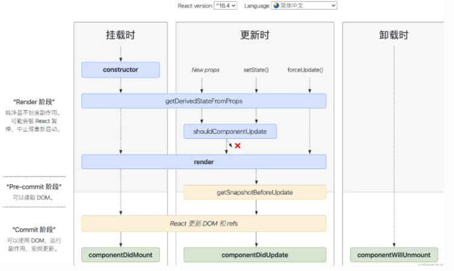

##  生命周期

装载阶段（Mount），组件第一次在DOM树中被渲染的过程；
更新过程（Update），组件状态发生变化，重新更新渲染的过程；
卸载过程（Unmount），组件从DOM树中被移除的过程；



## 生命周期总结

> 挂载：constructor、getDerivedStateFromProps、render、componentDidMount；
>
> 更新：getDerivedStateFromProps、shouldComponentUpdate、render、getSnapshotBeforeUpdate、componentDidUpdate；
>
> 卸载：componentWillUnmount；
>
> getDefaultProps：组件创建之前被调用一次（有且仅有一次），初始化组件的 Props；
>
> getInitialState：初始化组件的 state 值；


- React16：Render 阶段（用于计算一些必要的状态信息）、Pre-commit阶段、Commit 阶段

- 废弃了的生命周期：componentWillMount，componentWillReceiveProps，componentWillUpdate--不安全

- state 和 props 触发更新生命周期的区别

- shouldComponentUpdate、PureComponet（class组件）、Memo（ 函数组件 ）

PureComponet用作组件是否要渲染。内部实现了shouldComponentUpdate，但只进行对象的浅层比较，一层比较，对象或者数组无法比较。所以PureComponent最好只用于展示型组件。


```js
// PureComponet 示例
import React, { PureComponent } from 'react'
interface Iprops { info2: string }
class Son2 extends PureComponent<Iprops> {
  render() {
    console.log('son2重新渲染了....')
    return ( <div> <p>我是son2</p> <p>{this.props.info2}</p> </div> )
  }
}
export default Son2
```

给PureComponent包裹的子组件传入一个立即执行函数的时候，父组件的状态改变的时候，这个子组件始终会重新渲染


```js
<Son2 info2={this.state.info2} change={() => {}} />
```

因为 change 这个函数每次都会执行，所以导致 Son2 组件每次都会重新渲染

解决方法：父组件将这个立即执行函数，抽取到类方法上，并且在constructor bind this；

或者利用箭头函数将立即函数抽取成类属性

```js
// memos 示例
import React, { memo } from 'react'
interface Iprops { info2: string }
const Son3: React.FC<Iprops> = (props) => {
  console.log('son3重新渲染了....')
  return ( <div> <p>我是Son3</p> <p>{props.info2}</p> </div> )
}
export default memo(Son3)
```


##  **组件挂载阶段**


挂载阶段组件被创建，然后组件实例插入到 DOM 中，完成组件的第一次渲染

constructor、getDerivedStateFromProps、render、componentDidMount


-  1）constructor

初始化组件的 state；给事件处理方法绑定 this


```js
constructor(props) {
  super(props);
  this.state = { counter: 0 }   //不要在构造函数中调用setState，可直接给state设置初始值
  this.handleClick = this.handleClick.bind(this)
}
```

-  2）getDerivedStateFromProps

`static getDerivedStateFromProps(nextProps,prevState)`：接收父组件传递过来的 props 和组件之前的状态，返回一个对象来更新 state 或者返回 null 来表示接收到的 props 没有变化，不需要更新 state.

作用： 将父组件传递过来的 props 映射 到子组件的 state 上面，这样组件内部就不用再通过 this.props.xxx 获取属性值了，统一通过 this.state.xxx 获取。映射就相当于拷贝了一份父组件传过来的 props ，作为子组件自己的状态。

触发：在组件实例化、接收到新的 props 、组件状态更新时会被调用。


- 3）render

> React 元素：这里包括原生的 DOM 以及 React 组件；
> 数组和 Fragment（片段）：可以返回多个元素；
> Portals（插槽）：可以将子元素渲染到不同的 DOM 子树种；
> 字符串和数字：被渲染成 DOM 中的 text 节点；
> 布尔值或 null：不渲染任何内容。

- 4）componentDidMount()

执行依赖于DOM的操作；发送网络请求；添加订阅消息（会在componentWillUnmount取消订阅）；

如果在 componentDidMount 中调用 setState，就会触发一次额外的渲染，多调用了一次 render 函数


## **组件更新阶段**


当组件的 props 改变了，或组件内部调用了 setState/forceUpdate，会触发更新重新渲染，这个过程可能会发生多次。

这个阶段会依次调用下面这些方法：getDerivedStateFromProps、shouldComponentUpdate、render、getSnapshotBeforeUpdate、componentDidUpdate、

- 1）shouldComponentUpdate

组件渲染的两种情况：执行了setState或props发生改变；父组件重新渲染（不管传入的 props 有没有变化）

`shouldComponentUpdate(nextProps, nextState)`，比较 this.props 和 nextProps ，this.state 和 nextState，来确认返回 true 或者 false（后续的 render、componentDidUpdate 也不会被调用）

- 2）getSnapshotBeforeUpdate

`getSnapshotBeforeUpdate(prevProps, prevState)`：接收父组件传递过来的 props 和组件之前的状态，必须有返回值，返回值将作为第三个参数传递给 componentDidUpdate。必须和componentDidUpdate 一起使用，否则会报错。

触发：在 render 之后，componentDidUpdate 之前调用，更新 DOM 和 refs 之前

作用： 在组件更新 DOM 和 refs 之前，从 DOM 中捕获一些信息（例如滚动位置）

- 3) componentDidUpdate

` componentDidUpdate(prevProps, prevState, snapshot){} `

当组件更新后，对 DOM 进行操作；比较更新前后的 props，是否进行网络请求；


## **组件卸载阶段**

componentWillUnmount() 会在组件卸载及销毁之前直接调用

清除 timer，取消网络请求或清除；取消在 componentDidMount() 中创建的订阅等


