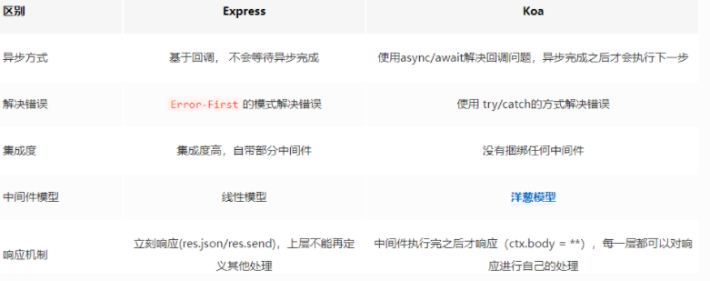

##  Koa与Express区别

[参考](https://juejin.cn/post/6844903968041091080)

两个框架都对http进行了封装。相关的api都差不多

Koa 洋葱模型，中间件执行顺序是 U 形的，在每一次 next() 后，都会进入下一个中间件，等最后一个中间件执行完以后，再从最后一个中间件的 next() 之后的代码往回执行

 Express 直线型，按照顺序一个一个 next 下去



> - express内置了许多中间件可供使用，而koa没有。
> - express包含路由，视图渲染等特性，而koa只有http模块。
> - express的中间件模型为线型，而koa的中间件模型为U型，也可称为洋葱模型构造中间件。
> - express通过回调实现异步函数，在多个回调、多个中间件中写起来容易逻辑混乱。

```js
// express写法
app.get('/test', function (req, res) {
    fs.readFile('/file1', function (err, data) {
        if (err) { res.status(500).send('read file1 error'); }
        fs.readFile('/file2', function (err, data) {
            if (err) { res.status(500).send('read file2 error'); }
            res.type('text/plain');
            res.send(data);
        });
    });
});
// koa通过generator和async/await使用同步来处理异步，好于callback和promise
app.use(async (ctx, next) => {
    await next();
    var data = await doReadFile();
    ctx.response.type = 'text/plain';
    ctx.response.body = data;
});
```


#  Koa.js

[参考](https://mp.weixin.qq.com/s/YiMplcQPTSbO2vz3fAzUeA)

-   koa 源码的 lib 目录 

```js
lib
  |- application.js   ---  入口文件：Application 类初始化
  |- context.js      ---   上下文：所有的req及res的方法集，控制哪些方法可读或者可写
  |- request.js
  |- response.js
```

##  **application.js**
  >Application: 基本服务器框架
 Context: 服务器框架基本数据结构的封装，用以 http 请求解析及响应
*Middleware: 中间件，也是洋葱模型的核心机制

application.js里面封装了很多方法： 

- **use 方法**： 初始化完 koa 实例后（const app = new Koa()），调用 **app.use()** 去挂载中间件，判断中间件为 function还是为 generator function 类型，将中间件函数 push 到 middleware数组中，循环调用 middleware 中的方法去执行， 

- **listen 方法**：在 use 完中间件之后**app.listen(3000)** ，node 原生启动 http 服务的方法--http.createServer

- **compose 方法**：生成洋葱模型，通过 koa-compose 包实现。 fn(context, dispatch.bind(null, i + 1))，中间件的第二个参数 next就是dispatch.bind(null, i + 1) ，执行 next() 实际上是下一个中间件的执行，这样await next() --后面所有中间件串联执行，即下上文中间件部分的执行顺序。

- **createContext 方法**：`const ctx = this.createContext(req, res) ` 将 req, res 及 this.request, this.response 都挂载到了 context 上，并通过赋值理清了循环引用层级关系。 

- **handleRequest 方法**：`this.handleRequest(ctx, fn)`拿到 ctx 和 compose 生成的洋葱模型，开始逐一消费中间件。


##  手写koa框架源码

- req 对象代表了一个HTTP请求，其具有一些属性来保存请求中的一些数据，比如query string，parameters，body，HTTP headers等等；

- res 对象代表了当一个HTTP请求到来时，Express 程序返回的HTTP响应。`res.send([body])`发送HTTP响应

```js
const http = require('http')

function compose (middlewares) {
  return ctx => {
    const dispatch = (i) => {
      const middleware = middlewares[i]
      if (i === middlewares.length) {  return }
      // app.use((ctx, next) => {})， 取出当前中间件，并执行
      // 在中间件中调用 next() 时，控制权交给下一个中间件；如果未调用，则接下来的中间件不会执行
      return middleware(ctx, () => dispatch(i+1))
    }
    return dispatch(0)
  }
}

// 使用 Context 对 req/res 进行了封装，并把 req/res 中多个属性代理到 Context 中，方便访问
class Context {
  constructor(req, res){ this.req = req; this.res = res }
}

class Application {
  constructor () { this.middlewares = [] }
  listen (...args) {
    const server = http.createServer(this.callback())  // 在listen 中处理请求并监听端口号
    server.listen(...args)
  }
  // app.callback() 将返回handleRequest 函数，方便测试
  callback () {
    return async (req, res) => {
      const ctx = new Context(req, res)
      // 使用 compose 合成所有中间件，在中间件中会做一些:路由解析、Body解析、 异常处理、统一认证等
      const fn = compose(this.middlewares)
      try { await fn(ctx) } catch (e) {
        ctx.res.statusCode = 500   // 异常处理函数---状态码
        ctx.res.end('Internel Server Error')
      }
      ctx.res.end(ctx.body)
    }
  }

  // 注册中间件，并收集在中间件数组中
  use (middleware) { this.middlewares.push(middleware) }
}

module.exports = Application
```
-   `app.use`的回调函数依然是原生的`http.crateServer`回调函数，而在koa中回调参数是一个Context对象。

-  构建 Context
在 koa 中，app.use 的回调参数为一个 ctx 对象，而非原生的 req/res。因此要构建一个 Context 对象，并使用 ctx.body 构建响应：

>app.use(ctx => ctx.body = 'hello, world'): 通过在 http.createServer 回调函数中进一步封装 Context 实现
Context(req, res): 以 request/response 数据结构为主体构造 Context 对象


