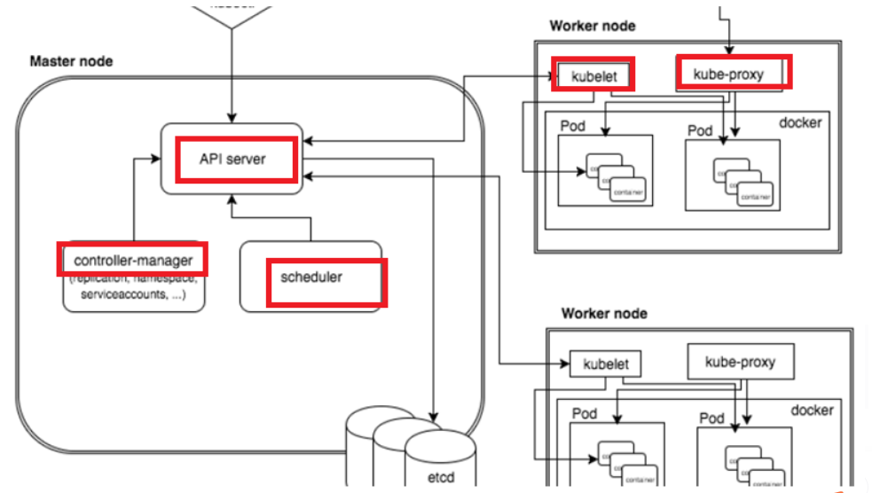

# k8s

kubernetes用于自动部署，扩展，管理容器化应用程序的分布式系统，将组成应用程序的容器组合成逻辑单元，便于管理和服务发现。

优点： 横向缩放副本数、 自动部署和回滚 、自我修复、服务发现和负载均衡


##  k8s基础概念



- Master：集群控制节点，负责整个集群的管理和控制

> - kube-apiserver：集群的统一入口，各组件协调者，以HTTP API提供接口服务，Kubernetes里所有资源的增删改查和监听操作都交给APIServer处理后再提交给Etcd存储
>
> - kube-controller-manager：所有资源对象的自动化控制中心
> - kube-scheduler：负责资源调度（Pod调度）的进程


- Node：工作负载节点。每个Node都会被Master分配一些工作负载，当某个Node宕机时，其上的工作负载会被Master自动转移到其他Node节点上。

> - kubelet：kubelet是Master在Node节点上的Agent，管理本机运行容器的生命周期，负责Pod对应容器的创建、启停等任务。同时与Master密切协作，获取Node节点上Pod的运行状态等
> - kube-proxy：在Node节点上实现Pod网络代理，实现k8s服务的通信和负载均衡机制，维护各个节点上的转发规则
> - Docker引擎：负责本机的容器的创建和管理工作


- Etcd：Etcd是一个高可用的键值存储系统，保存所有集群数据，


- Replication Controller：保证Pod持续运行，指定数量的Pod副本， 比如滚动升级和弹性伸缩 


- ReplicaSet：Deployment 是通过 ReplicaSet 来管理 Pod 的多个副本


- Deployment：应用管理者，是用于部署应用的对象


- Pod：是一组容器，容器共享数据卷volume、 IP地址和端口 


- Service：一组pod的统一入口，微服务，提供DNS解析名称，负责追踪pod动态变化并更新转发表，通过负载均衡算法最终将流量转发到后端的pod

  >- ClusterIP：Service在集群内的唯一ip地址，虚拟的IP，只能在 Kubernetes集群里访问后端的Pod;
  >- NodeIP+NodePort：Service会在集群的每个Node上都启动一个端口，通过NodeIP:NodePort访问后端的Pod；


- Label：一个key=value的键值对，可被附加到各种资源对象上，例如Node、Pod、Service、RC等


- Volume： 存储卷，Pod中能够被多个容器共享的磁盘目录，Docker容器中的数据都是非持久化的，在容器消亡后数据也会消失，因此Docker提供了Volume机制以便实现数据的持久化

  > - emptyDir：临时空间，Pod分配到Node时创建，无须指定宿主主机上对应的目录--- 自动分配 
  > - hostPath：为Pod挂载宿主主机上-- 不同的Node 的文件或目录。用于数据永久保存
  > - NFS：网络文件系统，可挂载 NFS 到 Pod 中
  > - Persistent Volume：PV 网盘，网络存储，不属于任何Node, 但在每个Node上都可访问


- Namespace：命名空间，实现多租户的资源隔离


- ConfigMap：配置信息的集合，可注入到Pod中的容器使用做为存储卷。

##  基本命令

```js
// 指定某个node节点起pod
sudo /apps/bin/kubectl get nodes xxxxx --show-labels
//   kubernetes.io/hostname=xxxxx
      nodeSelector:
        noderole: xxxxxx

//****************  命令  ****************
kubectl create -f xxx.yaml
kubectl delete -f xxx.yaml
kubectl apply -f xxx.yaml

kubectl expose deployment nginx --port=80  --type=NodePort

// 查看服务详情
sudo /apps/bin/kubectl describe pod xxxx-pod-name-xxx -n xxx-namesapce-xxxx

// 查看创建的服务  ---  查看集群给服务自动分配的ip和端口，ClusterIP 、 NodePort
sudo /apps/bin/kubectl get svc

// 查看所有的命名空间 --- default、 kube-system、 kube-public \ kube-node-lease
sudo /apps/bin/kubectl get ns

// 查看某个服务的日志
sudo /apps/bin/kubectl logs -f xxxxxxx

//  进入所起的pod内部
/apps/bin/kubectl exec -it my-vue-web-7d764cfd68-jkrqj  bash -n mynamespace
cd /etc/nginx/
cat /etc/nginx/conf.d/default.conf
```

##  yaml 文件


```javascript
apiVersion: v1
kind: ConfigMap
metadata:
  name: web-vue-config
data:
  default.conf: |-
    server {}
  configurable-variable.json: |-
    {}

---
apiVersion: v1
kind: Service
metadata:
  name: my-web-vue
  labels:
    app: myapp
spec:
  ports:
    - port: 80
      targetPort: 80
      protocol: TCP
  type: ClusterIP
  selector:
    app: myapp
    tier: web-vue
---
apiVersion: apps/v1 
kind: Deployment
metadata:
  name: my-web-vue
  labels:
    app: myapp
spec:
  selector:
    matchLabels:
      app: myapp
      tier: web-vue
  replicas: 1
  strategy:
    type: Recreate
  template:
    metadata:
      labels:
        app: myapp
        tier: web-vue
    spec:
      nodeName: node01
      containers:
      - name: my-web-vue
        image: registry.paas/xxxx/bc-web-vue:ci-20211217200218
        ports:
        - containerPort: 80
          name: web-vue
        volumeMounts:
        - mountPath: "/usr/share/nginx/html/config/configurable-variable.json"
          subPath: configurable-variable.json
          name: web-vue-config
        - mountPath: "/etc/nginx/conf.d/default.conf"
          subPath: default.conf
          name: web-vue-config
        - mountPath: "/var/log/nginx"
          name: web-vue-logs
          subPath: web-vue
      volumes:
      - name: web-vue-config
        configMap:
          name: web-vue-config
      - name: web-vue-logs
        persistentVolumeClaim:
          claimName: local-log
```


