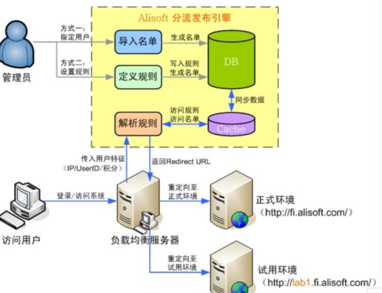

##  蓝绿发布与灰度发布

**蓝绿发布**，是指同时运行两个版本的应用。在部署时，不停掉老版本，直接部署一套新版本，等新版本运行起来后，将流量切换到新版本上。**但是蓝绿部署要求在升级时，同时运行两套程序，对硬件的要求是日常所需的两倍**。

**灰度发布**是指在黑与白之间，能够平滑过渡的一种发布方式。AB test就是一种灰度发布方式，让一部分用户继续用A，一部分用户开始用B，如果用户对B没有什么反对意见，那么逐步扩大范围，把所有用户都迁移到B上面来。

##  nginx转发

两份代码，分别部署
通过nginx加权轮询来控制访问百分比（在客户端cookie不存在标识的前提）
前端引入了sdk（往cookie存入一个随机不重复的标识）
二次访问的时候，nginx通过对cookie中的唯一标识来返回对应的版本

```js
set $group "default";
if ($http_cookie ~* "version=V1.0"){ # 携带1.0标志的用户去1.0服务器
     set $group server_01;
}
if ($http_cookie ~* "version=V2.0"){ # 携带2.0标志的用户去2.0服务器
     set $group server_02;
}
```

-  **缺点**
1.  只能简单依赖nginx加权轮询百分比来控制流量，全靠前端，无法结合业务做分流
2.  可控性弱，在灰度版本出现问题的时候，只能通过修改nginx配置来让用户回退版本 
3.  问题收集能力差，只能等待用户反馈 
4.  在客户端cookie被清理掉后，用户需要重新通过nginx的加权轮询进入，有可能被分配到与上一个分配不同的版本


##  **ingress-nginx**

Ingress-nginx一般由三个组件组成：

*   1）**反向代理负载均衡器**：通常以service的port方式运行，接收并按照ingress定义的规则进行转发，常用的有nginx，Haproxy，Traefik等，本文中使用的就是nginx。
*   2）**ingress-nginx-Controller**： 监听APIServer，根据用户编写的ingress规则（编写ingress的yaml文件），动态地去更改nginx服务的配置文件，并且reload重载使其生效，此过程是自动化的（通过lua脚本来实现）。
*   3）**Ingress服务**：将nginx的配置抽象成一个Ingress对象，当用户每添加一个新的服务，只需要编写一个新的ingress的yaml文件即可。

Ingress-nginx的工作原理：

>*   1）ingress controller通过和kubernetes api交互，动态的去感知集群中ingress规则变化。
>
>*   2）然后读取它，按照自定义的规则，规则就是写明了那个域名对应哪个service，生成一段nginx配置。 
>*   3）在写到nginx-ingress-controller的pod里，这个Ingress controller的pod里运行着一个Nginx服务，控制器会把生成的nginx配置写入/etc/nginx.conf文件中   
>*   4）然后reload一下使配置生效，以此达到分配和动态更新问题。

- 规则

> - nginx.ingress.kubernetes.io/canary-by-header：如果请求头中包含这里指定的 header 名称，并且值为 always 的话，就将该请求转发给该 Ingress 定义的对应后端服务；如果值为 never 就不转发，可以用于回滚到旧版
>
> - nginx.ingress.kubernetes.io/canary-by-header-value:  允许指定请求头的值可以自定义成其它值
> - nginx.ingress.kubernetes.io/canary-by-header-pattern: 用正则表达式对来匹配请求头的值 
> - nginx.ingress.kubernetes.io/canary-by-cookie:   用于 cookie，同样也是只支持 always 和 never
> - nginx.ingress.kubernetes.io/canary-weight:   表示 Canary Ingress 所分配流量的比例的百分比，取值范围 [0-100]，比如设置为 10，意思是分配 10% 的流量给 Canary Ingress 对应的后端服务。

支持基于 Header、Cookie 和服务权重这 3 种流量切分的策略，优先顺序如下：canary-by-header -> canary-by-cookie -> canary-weight

-  **存在的缺陷**
相同服务的 Canary Ingress 只能定义一个，所以后端服务最多支持两个版本。  
Ingress 里必须配置域名，否则不会有效果。  
即便流量完全切到了 Canary Ingress 上，旧版服务也还是必须存在，不然会报错。


```yaml
apiVersion: networking.k8s.io/v1beta1
kind: Ingress
metadata:
  annotations:
    nginx.ingress.kubernetes.io/rewrite-target: /lancelot/$2
    nginx.ingress.kubernetes.io/use-regex: "true"
    nginx.ingress.kubernetes.io/proxy-body-size: "300M"
  name: dw-lancelot
spec:
  rules:
  - http:
      paths:
      - pathType: Prefix
        path: "/lancelot(/|$)(.*)"
        backend:
          serviceName: dw-lancelot
          servicePort: 8888
```


##   **nginx + lua + redis**

nginx+lua实现反向代理，获取客户端ip；redis存放ip信息

>在Openresty中通过ngx_http_lua_module模块的指令access_by_lua_file，解析指定的lua脚本，通过lua脚本获取客户端的IP地址，请求header头中的userId和设备ID，将以上信息在Redis中做比对，如果存在则代理跳转到灰度环境，否则代理跳转到生产环境中。 

```js
server {
  listen 80;
  server_name localhost;
    location / {
      set $group '';
      access_by_lua '
        if ngx.var.http_cookie=="test" 
        then ngx.var.group="nettest1"
        else ngx.var.group="nettest" end
      ';
      proxy_pass http://$group;
    }
}
```


##  **nginx + 服务端 + redis + [前端sdk]**

*  我们先把线上的稳定版本称为stable版，本次发布的新功能版本称为beta版
*  开发人员给stable和beta版本各自启动了nginx服务，在运维层启动了一层入口nginx服务，作为转发
*   客户端通过域名访问项目，通过请求灰度规则，命中灰度规则后，并给客户端设置cookie作为标识，并将用户标识存放到redis，将用户重定向到指定的版本
    
*   灰度规则接口请求的时候，如果已经带有cookie则直接返回对应版本，不存在cookie则去查找redis，redis中存在对应信息则直接返回，如果不存在则走灰度规则识别流程
    
*   前端sdk功能：用于控制发起灰度规则请求的时机、回调操作和其他业务操作

**sdk的使用场景**：  
>项目中需要在特定的时机触发灰度功能，点击某个按钮，或者进入某个页面，比如某些应用是会弹出弹窗，告诉用户有内测版本，是否需要体验，点击同意后才跳转到灰度版本

- 如果在上线后灰度版本出现严重的问题，需要紧急回退操作 --->   直接后台关闭灰度功能，清除redis，结束用户的登录会话（实际是清除客户端cookie操作）
    
- 指定某个用户进入某个版本 ---->  后台修改redis信息，结束用户的登录会话
    
-  指定项目中某个页面才启用灰度  --->   可以在前端sdk中处理相关逻辑，把相关的页面路径作为名单给前端识别（sdk最好动态引入，sdk放在cdn上）





