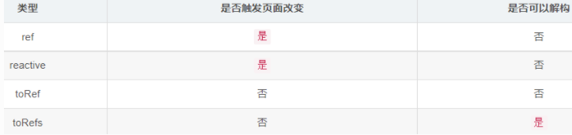

:::tip
ref、reactive、toRef、toRefs响应式数据

*   ref、reactive、toRef、toRefs 这些方法 均需从`vue`中导入到组件。
*   ref、reactive、toRef、toRefs 创建的变量在 setup 中都需要`return { ... }`抛出才可在页面使用，除非你是为props创建响应式。

[参考](https://yingliyu.github.io/2021/01/12/vue3-01/)
:::


##    ref() 和 reactive()

*   ref用来定义：**基本类型数据**。
*   ref通过`Object.defineProperty()`的`get`与`set`来实现响应式（数据劫持）。
*   ref定义的数据：操作数据需要`.value`，读取数据时模板中直接读取不需要`.value`。
*   reactive用来定义：**对象或数组类型数据**。
*   reactive通过使用**Proxy**来实现响应式（数据劫持）, 并通过**Reflect**操作源代码内部的数据。
*   reactive定义的数据：操作数据与读取数据：均不需要`.value`。

ref可以定义对象或数组的，它只是内部自动调用了**reactive**来转换

```
<template>
  <div><h3>{{ temp }}</h3><p>{{ user.name }}</p><p>{{ user.age }}</p>
    <button @click="increase">click me!</button>
  </div>
</template>

import { ref, reactive } from 'vue'
export default {
  setup() {
    const temp = ref(0)
    temp.value = 'hello'
    const user = reactive({ name: 'lemon', age: 20 })
    console.log(temp)
    console.log(temp.value) // hello
    console.log(user) // Proxy {name:'lemon',age:20}

    const increase = () => { user.age++ }
    return { temp, user, increase }
  }
}
```

`reactive()`函数可以代理一个复杂数据类型比如：对象、数组，但不能代理基本类型值，例如字符串、数字、boolean 等，
用`ref()`函数来间接对基本类型值进行处理。

-  `ref`的本质还是`reactive`系统会自动根据`ref()`函数的入参将其转换成`ref(x)`即`reactive({value:x})`

-  `ref(user.name)`就相当于`ref('lemon')`也相当于`reactive({value:'lemon'})`


1.  在 vue 模板中使用`ref`的值不需要通过`value`属性获取（vue 会自动给 ref 的值加上.value）
2.  在 js 中使用`ref`的值要通过`.value`获取


##  toRef() 和 toRefs()

toRef是将个对象 A 中的某个属性 x 转换为响应式数据，
其接收两个参数，第一个参数为对象 A，第二个参数为对象中的某个属性名 x。

```
import { toRef } from 'vue'
export default {
  setup() {
    const user = { name: 'lemon', age: 3 }
    const userRef = toRef(user, 'age')
    return { userRef }
  }
}
```


```
<script lang="ts">
import { ref, toRef } from "vue";
export default {
  setup() {
    const temp = { count: 1 };
    const temp0 = 1;
    const state0 = ref(temp0);
    const state1 = ref(temp.count);
    const state2 = toRef(temp, "count");

    const add0 = () => {
      state0.value++;
      console.log("原始值：", temp0); //原始值：1
      console.log("响应式数据对象ref：", state0.value); //响应式数值ref：2
    };
    const add1 = () => {
      state1.value++;
      console.log("原始值：", temp); //原始值：1
      console.log("响应式数据对象ref：", state1.value); //响应式对象ref：2
    };
    const add2 = () => {
      state2.value++;
      console.log("原始值：", temp); // 原始值：2
      console.log("响应式数据对象toRef：", state2.value); //响应式对象toRef：2
    };
    return { state0, state1, state2, add0, add1, add2 };
  },
};
</script>
```

##   ref()和 toRef()有以下区别

1.  参数不同：`ref()`接收一个 js 基本数据类型的参数；`toRef()`接收两个参数，第一个为对象，第二个为对象中的某个属性；
2.  原理不同：`ref()`是对原数据的一个深拷贝，当其值改变时不会影响到原始值；`toRef()`是对原数据的一个引用，当值改变时会影响到原始值；
3.  响应性不同：`ref()`创建的数据会触发 vue 模版更新；`toRef()`创建的响应式数据并不会触发 vue 模版更新，所以`toRef()`的本质是引用，与原始数据有关联。


###   toRefs()

- 对象的多个属性都变成响应式数据，并且要求响应式数据和原始数据相关联，并且更新响应式数据时不更新界面，这时候用`toRefs()`

- 对响应式对象进行 toRefs 后，可以对其进行解构方便 vue 模版使用，但是不会使其失去响应性。
  reactive()响应式数据通过js结构之后，会丢失响应

```
setup() {
    const state = reactive({ foo: 1, bar: 2 }) // 创建响应式对象state
    const stateAsRefs = toRefs(state) // 将响应式的对象变为普通对象结构
    state.foo++
    console.log(stateAsRefs.foo.value) // 2

    stateAsRefs.foo.value++
    console.log(state.foo) // 3
    return { ...stateAsRefs };
}
```

toRefs()将响应式的对象 state 变为普通对象 stateAsRefs 后，
return 时使用 ES6 的扩展运算符，在模版中可以直接使用其内部属性，且仍具有响应性
（对响应式对象 state 使用扩展运算符后，其内部属性就失去了响应性 ）



##   响应式判断

isRef: 检查值是否为一个 ref 对象。
isReactive：检查对象是否是由 reactive 创建的响应式代理。
isReadonly: 检查对象是否是由 readonly 创建的只读代理。
isProxy：检查对象是否是由 reactive 或 readonly 创建的 proxy。

```js
import {ref, reactive,readonly,isRef,isReactive,isReadonly,isProxy } from 'vue'
export default {
  name:'App',
  setup(){
    let fullName = reactive({name:'小唐',price:'20k'})
    let num = ref(0)
    let fullNames = readonly(fullName)
    console.log(isRef(num))
    console.log(isReactive(fullName))
    console.log(isReadonly(fullNames))
    console.log(isProxy(fullName))
    console.log(isProxy(fullNames))
    console.log(isProxy(num))
    return {}
  }
}
```


